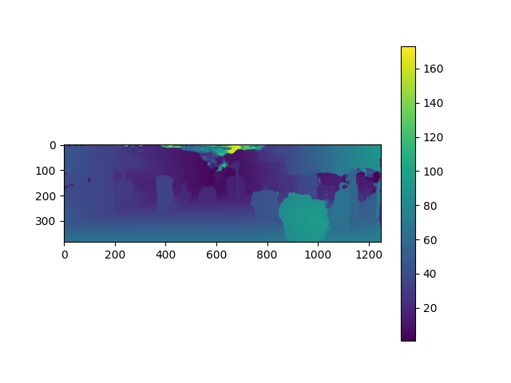
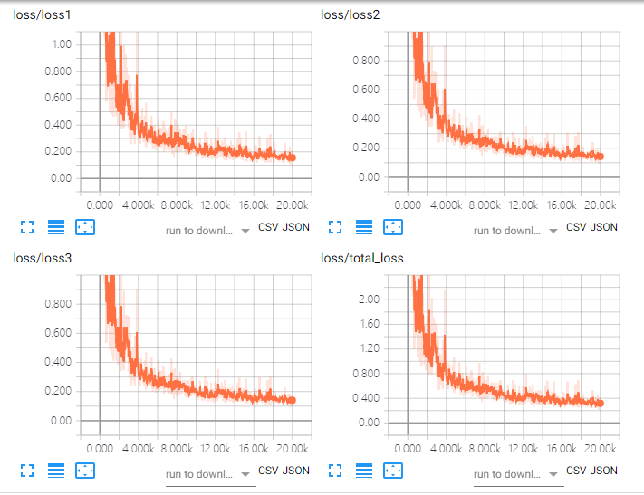
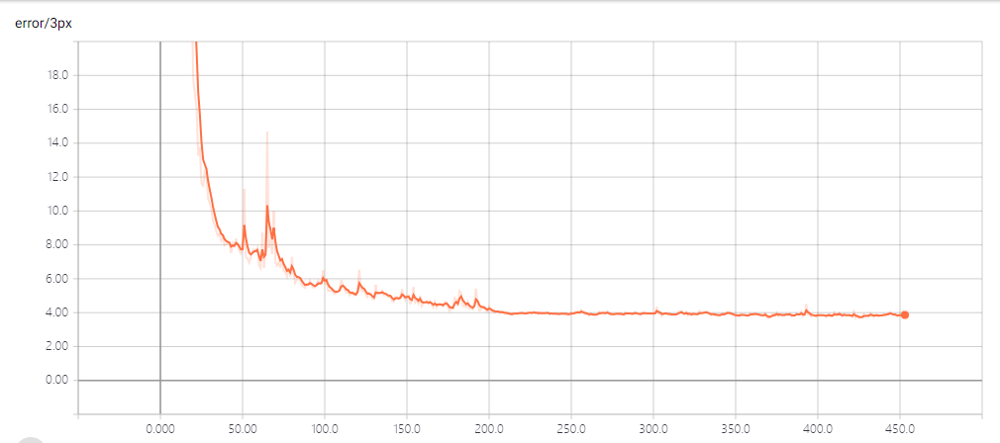

# PSM-Net

Pytorch reimplementation of PSM-Net: "[Pyramid Stereo Matching Network](https://arxiv.org/abs/1803.08669)" paper (CVPR 2018) by Jia-Ren Chang and Yong-Sheng Chen.

Official repository: [JiaRenChang/PSMNet](https://github.com/JiaRenChang/PSMNet)


## Usage

### 1) Requirements

- Python3.5+
- Pytorch0.4
- Opencv-Python
- Matplotlib
- TensorboardX
- Tensorboard

All dependencies are listed in `requirements.txt`, you execute below command to install the dependencies.

``` shell
pip install -r requirements.txt
```


### 2) Train

``` shell
usage: train.py [-h] [--maxdisp MAXDISP] [--logdir LOGDIR] [--datadir DATADIR]
                [--cuda CUDA] [--batch-size BATCH_SIZE]
                [--validate-batch-size VALIDATE_BATCH_SIZE]
                [--log-per-step LOG_PER_STEP]
                [--save-per-epoch SAVE_PER_EPOCH] [--model-dir MODEL_DIR]
                [--lr LR] [--num-epochs NUM_EPOCHS]
                [--num-workers NUM_WORKERS]

PSMNet

optional arguments:
  -h, --help            show this help message and exit
  --maxdisp MAXDISP     max diparity
  --logdir LOGDIR       log directory
  --datadir DATADIR     data directory
  --cuda CUDA           gpu number
  --batch-size BATCH_SIZE
                        batch size
  --validate-batch-size VALIDATE_BATCH_SIZE
                        batch size
  --log-per-step LOG_PER_STEP
                        log per step
  --save-per-epoch SAVE_PER_EPOCH
                        save model per epoch
  --model-dir MODEL_DIR
                        directory where save model checkpoint
  --lr LR               learning rate
  --num-epochs NUM_EPOCHS
                        number of training epochs
  --num-workers NUM_WORKERS
                        num workers in loading data
```

For example:

``` shell
python train.py --batch-size 16 \
                --logdir log/exmaple \
                --num-epochs 500
```


### 3) Visualize result

This repository uses tensorboardX to visualize training result. Find your log directory and launch tensorboard to look over the result. The default log directory is `/log`.

``` shell
tensorboard --logdir <your_log_dir>
```

Here are some of my training results (have been trained for 1000 epochs on KITTI2015):









### 4) Inference

``` shell
usage: inference.py [-h] [--maxdisp MAXDISP] [--left LEFT] [--right RIGHT]
                    [--model-path MODEL_PATH] [--save-path SAVE_PATH]

PSMNet inference

optional arguments:
  -h, --help            show this help message and exit
  --maxdisp MAXDISP     max diparity
  --left LEFT           path to the left image
  --right RIGHT         path to the right image
  --model-path MODEL_PATH
                        path to the model
  --save-path SAVE_PATH
                        path to save the disp image
```

For example:

``` shell
python inference.py --left test/left.png \
                    --right test/right.png \
                    --model-path checkpoint/08/best_model.ckpt \
                    --save-path test/disp.png
```


### 5) Pretrained model

A model trained for 1000 epochs on [KITTI2015](http://www.cvlibs.net/datasets/kitti/eval_scene_flow.php?benchmark=stereo) dataset can be download [here](https://drive.google.com/open?id=1JW330o2UGQi6XGB4o3pD_MdGttYwiZdv). (I choose the best model among the 1000 epochs)

```
state {
    'epoch': 857,
    '3px-error': 3.466
}
```

## Task List

- [x] Train
- [x] Inference
- [x] KITTI2015 dataset
- [ ] Scene Flow dataset
- [x] Visualize
- [x] Pretained model

## Contact

Email: checkdeng0903@gmail.com

Welcome for any discussions! 

